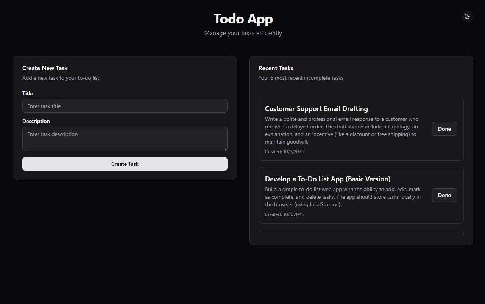

# Task Management Frontend

A modern React task management application with TypeScript, Zustand state management, and a beautiful UI powered by shadcn/ui and Tailwind CSS.



## Features

- Create and manage tasks with form validation
- Mark tasks as complete
- Dark/Light theme toggle
- Responsive design
- Toast notifications
- Comprehensive test coverage (80%+)

## Tech Stack

- **React 19** + **TypeScript**
- **Zustand** - State management
- **React Hook Form** + **Zod** - Form handling & validation
- **Tailwind CSS v4** + **shadcn/ui** - Styling
- **Axios** - HTTP client
- **Jest** + **React Testing Library** - Testing
- **Vite** - Build tool

## Getting Started

```bash
# Install dependencies
npm install

# Set up environment variables
echo "VITE_API_URL=http://localhost:3000/api" > .env

# Start development server
npm run dev
```

## Available Scripts

```bash
npm run dev          # Start development server
npm run build        # Build for production
npm test             # Run tests with coverage
npm run test:watch   # Run tests in watch mode
npm run lint         # Lint code
```

## Docker Deployment

```bash
# Build and run
docker build -t todo-frontend .
docker run -p 80:80 todo-frontend

# Or use docker-compose (from project root)
docker-compose up
```

## Project Structure

```
src/
├── components/         # React components
│   ├── ui/            # shadcn/ui components
│   ├── TaskForm.tsx
│   └── TaskList.tsx
├── store/             # Zustand stores
├── lib/               # API client & utilities
├── types/             # TypeScript types
└── __tests__/         # Test files
```

## Environment Variables

| Variable | Description | Default |
|----------|-------------|---------|
| `VITE_API_URL` | Backend API URL | `http://localhost:3000/api` |

## License

MIT